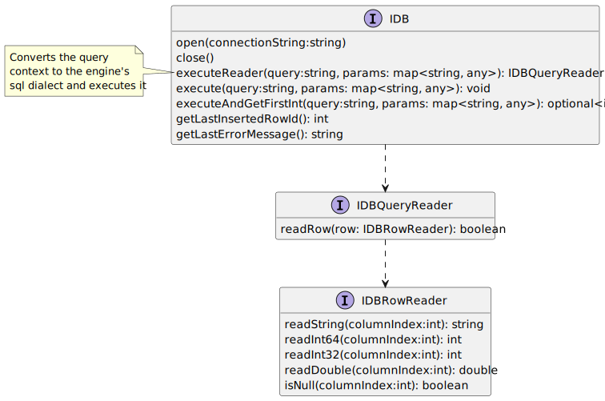
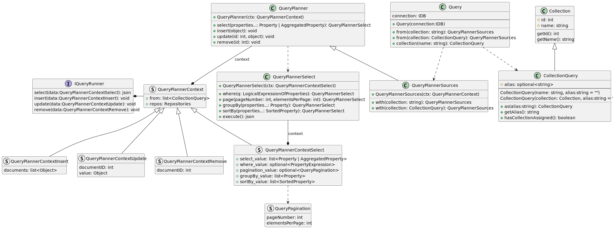
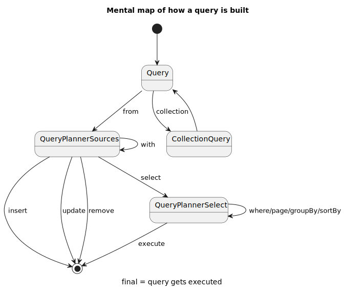
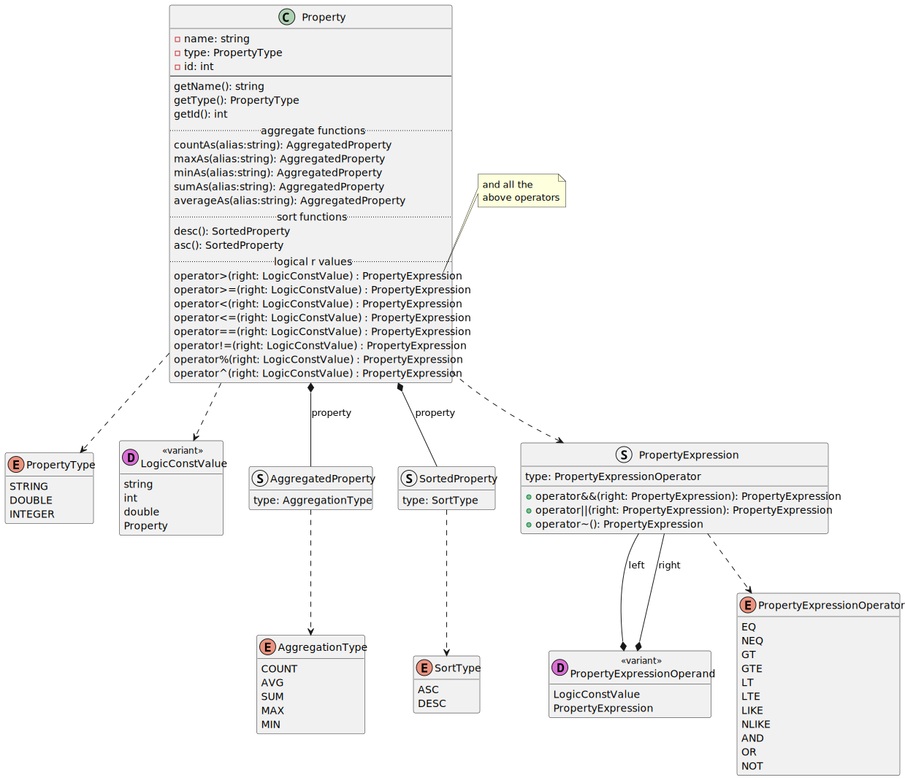
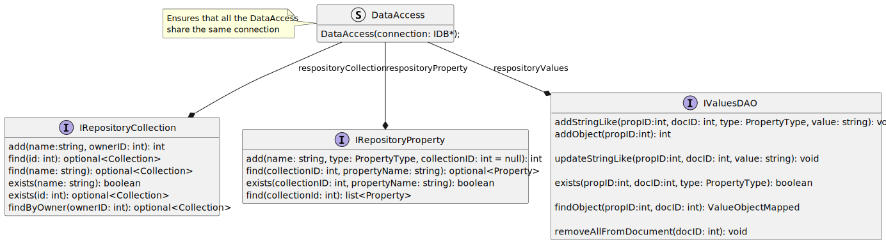

# Diagrams
## Database interface class diagram


## Query planner class diagram
We store the context like this since some clauses share properties.

### When and where the collection is created?
If it's missing in an `insert`, we create it when the query is executed in the repository. 
But, in an `select`, `remove/delete`, `update` no collection is created in case it doesn't exists.

#### **Example 1**
```c++
auto res = query.from("cars")
                .insert(...);
```
if the collection `cars` doesn't exists we create it in the `insert` call.

#### **Example 2**
```c++
auto res = query.from("cars").select()
```
in case `cars` doesn't exists returns an empty object, without creating the collection.

#### **Example 3**
```c++
CollectionQuery cars = query.collection("cars")
```
Since `CollectionQuery` is just a placeholder, no collection is created.






## Property class diagram
In this diagram I needed to choose between creating a class/structure for each type of each operation, like sort asc, sort desc, aggregate count, etc. or just use a single class/structure with an enum. If the logic operators weren't so many I would have choose the first as it makes more sense in general, but more using variant with the visitor pattern.

The same applies for property type, but in this case I would need to make a base property class with all the operation >, <, >=, etc. then a base class for sort property which inherits from that base class and defines `asc` and `desc`, the same for aggregate property. After that 4 new classes appear, PropertyString or StringProperty, IntegerProperty, DoubleProperty, ObjectProperty, which is fine since they all share the BaseProperty members id and name. The problem comes when you try to identify which type is the property, because sort property builds "SortedProperty" from the base property, which doesn't have a "property type".



## Repository class diagram
There is no `updateObject` because you don't update an object, you update its properties.



# How we inject the implementations
The main goal is for us to only select an implementation once during the lifetime of the library. To do this, when you add a new implementation, you are also responsible for specifying which repository and query runner implementation to use for it.

This is one of the weakest points in the design and harder to solve, so I just handled the responsibility to the `IDB` interface.

# How to make a new implementation
...

# Multithread
The library is thread safe.

## How safe?
Very. It coordinates threads using a mutex so only one can do a "complete operation" at a time. The operations are: insert, select, update and remove.